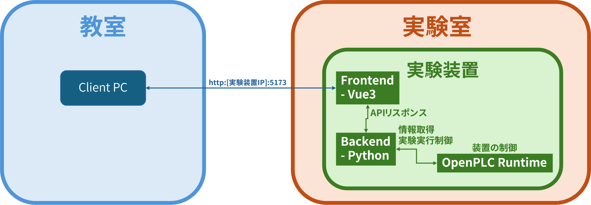

# Remote OpenPLC
| 基本情報 | 内容 |
| :---: | --- |
| 作成者 | ac234704 |
| 権利所有機関 | 沖縄高専、石川高専 |

このアプリケーションは、OpenPLC Runtimeで制御しているマイコンを遠隔で制御・監視するためのアプリケーションです。

## 技術情報
### システム構成図
システム構成図は、以下の通りです。
Vue3をフロントエンド、Pythonをバックエンドにしています。



### プログラミング言語/フレームワーク
以下の技術を使用して作成しました。
- Node.js
  - Vue3
    - axios
    - highcharts
    - pinia
    - vite
- Python
  - fastapi
  - uvicorn
  - opencv-python
  - pyserial
  - pymodbus

### 開発環境
- windows11
- Node.js v22.9.0
- Python 3.12.7
- VS code

## 使い方
### インストール方法
Windows/Linux系列のインストール方法を示します。

このインストール方法は、Git、Node.js、Pythonの環境が既に構築されているコトを前提しています。インストールしていないものがある場合は、ネットの記事や公式情報からインストールしてください。

1. リポジトリのダウンロードする
   ```bash
   cd [任意の場所]
   git clone https://github.com/ayano-yuki/Work-RemoteOpenPLC.git
   ```
2. Frontendの環境を整える
   ```bash
   cd Front
   npm install
   cd ../
   ```
3. API起動に必要なライブラリをインストールする
   ```bash
   cd API
   pip install -r requirements.txt
   cd ../
   ```

### 実行方法
1. OpenPLC Runtimeを起動させ、任意のプログラムを実行する
2. run_api.batを起動させる
3. run_front.batを起動させる

※上記の手順でも実行方法が分からない場合は、「./markdown/video/操作手順動画・2024年8月9日.webm」をご覧ください

※.batはwindwos用なので、拡張子を「.sh」にしてください

## 機能説明
各領域に実装している機能を紹介します。

### Frontend
- ホーム画面
  - 設定画面、実行画面の遷移を選択する画面
- 設定画面
  - 実験で観察したい項目を設定する画面
- 実行画面
  - 実験の観察・制御をする画面

### API
- カメラ映像の取得
- 設定情報の保存
- 実験データの保存
- 実験の開始・終了の制御
- 実験データの取得

## 知っておいたほうが良い用語
このアプリケーションを用いた研究をする際に、知っておいたほうがが良い用語を掲載します。簡単にしか紹介しないため、自身で調べることを推奨します。

- OpenPLC
  - IEC 61131-3規格に準拠したオープンソースのソフトウェアPLC
- modbus通信
  - 産業用機器同士の通信で広く利用されているプロトコルで、PLCをはじめ、さまざまな機器間のデータのやり取りを可能にする
- in situ実験
  - 石川高専が提案した**座学と実験を融合した授業方法**

## その他
- 連絡が取りたい方は、issueか、Twitter(現X)までご連絡ください。または、先生経由からご連絡ください。
  - Twitter(現X)：@__ayanoYuki__
- 2024/10時点で分かっている課題点・展望はissueに書いています。
- OpenPLCや、modbus通信をまとめた記事を執筆予定です。執筆後はココに掲載します。