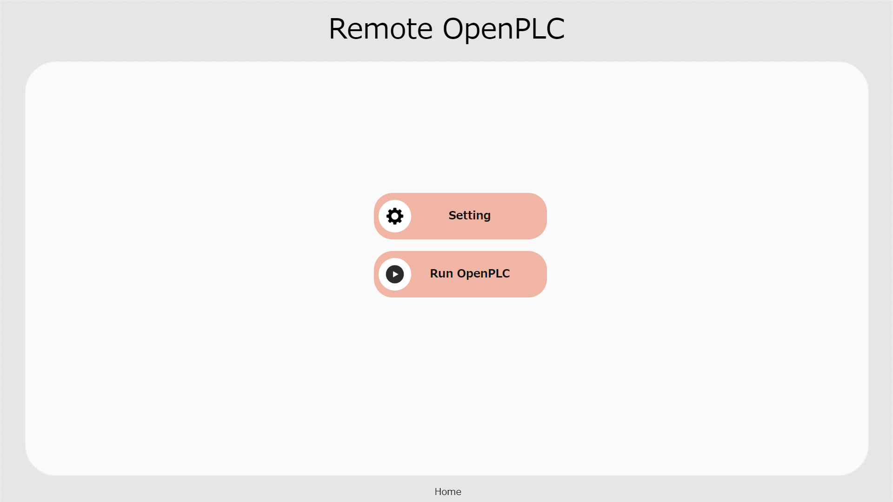
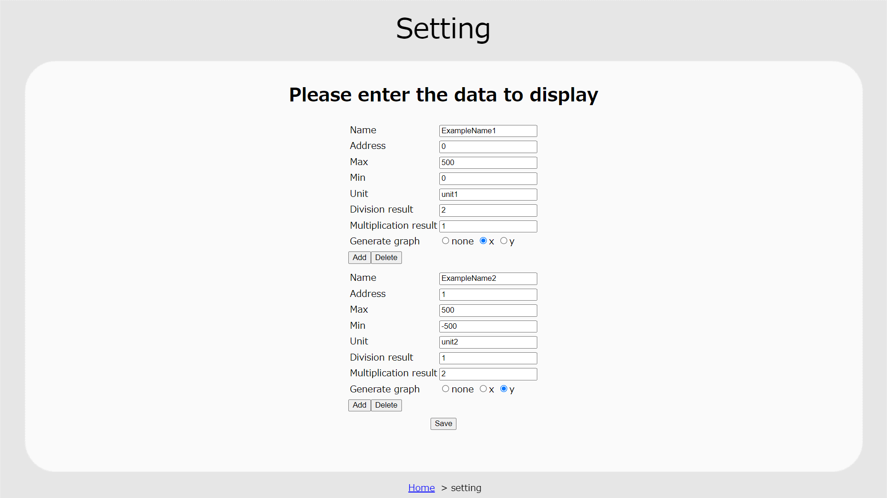
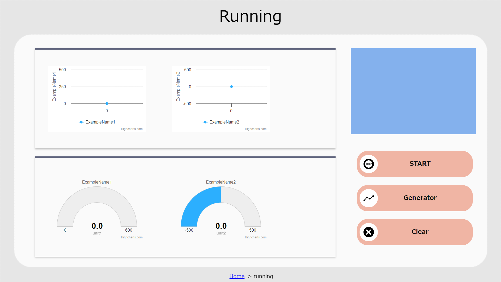

# 画面の説明
## ホーム画面の説明
この画面は、実行画面に表示するグラフの設定をするSetting画面に遷移する「Settingボタン」と、実行画面に遷移する「Run OpenPLCボタン」がある。

## 設定画面
この画面は、行画面に表示するグラフの設定をする画面となっている。設定項目は以下の表のようになっており、設定フォーム毎に設定フォームを追加できる「addボタン」と、設定フォームを削除する「Deleteボタン」がある。最低でも設定フォームは1つ必要であり、「sav上上上ボタン」で設定を保存できる。

| 設定項目 | 内容 |
| ---- | ---- |
| Name  | グラフのタイトルに使用する名前を入力する。初期値は空白となっており、同じ名前を登録することはできない。また、空白で設定することができない項目となっている。 | 
| Adress | グラフに描画したいOpenPLC Editorで設定したレジスタの読み込みアドレス（%QX）を入力する。初期値は空白となっており、同じレジスタの読み込みアドレスを設定できる。また、空白や数字以外の値で設定することができない項目となっている。  例）「%QX0.0」を描画したいのなら、0を入力する。 |
| Max | グラフの最大値を入力する。初期値は空白となっており、空白や数字以外の値で設定することができない項目となっている。また、設定する値は最小値を下回る値を設定できない。 |
| Min | グラフの最小値を入力する。初期値は空白となっており、空白や数字以外の値で設定することができない項目となっている。また、設定する値は最大値を上回る値を設定できない。 |
| Unit | グラフに描画する値の単位を入力する。初期値は空白ととなっており、同じ単位を設定できる。また、空白で設定することができない項目となっている。 |
| Division result | グラフに描画したい値を割り算し、値を整形するために入力する。初期値は1となっており、空白や数字以外の値で設定することができない項目となっている。 |
| Multiplication result | グラフに描画したい値を掛け算し、値を整形するために入力する。初期値は1となっており、空白や数字以外の値で設定することができない項目となっている。 |
| Generate graph | 実験終了後に出力できる2変数グラフにこの値を使用するかをラジオボタンで設定する。初期値はnoneとなっており、xとyが1つずつか、全てnone以外は設定できないようになっている。 |

## 実行画面
この画面は、実験設定画面で保存したデータを基に実験データをmodbus通信で取得し、表示する画面となっている。左下はグラフタイトルの現在値を表示し、左上はグラフタイトルのデータの変移を表示する。表示するグラフの数が多い場合は、横スクロールでグラフを見ることができる。右上は実験中のカメラ映像を表示する場所であり、この場所をクリックすると、カメラ映像が切り替わる。右下のボタンは、実験を開始/終了を制御する「Start/Endボタン」、実験終了後にクリックすると2変数グラフを表示する「Generatorボタン」、実験データをcsv形式でダウンロードした後に初期化する「Clearボタン」がある。

